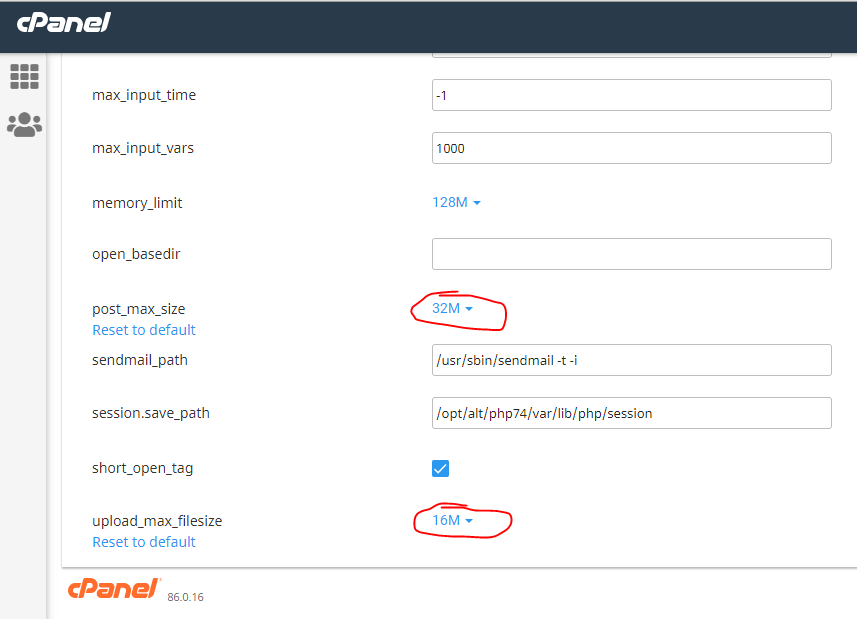

# Lumen PHP Framework

[](https://travis-ci.org/laravel/lumen-framework)
[](https://packagist.org/packages/laravel/lumen-framework)
[](https://packagist.org/packages/laravel/lumen-framework)
[](https://packagist.org/packages/laravel/lumen-framework)

Laravel Lumen is a stunningly fast PHP micro-framework for building web applications with expressive, elegant syntax. We believe development must be an enjoyable, creative experience to be truly fulfilling. Lumen attempts to take the pain out of development by easing common tasks used in the majority of web projects, such as routing, database abstraction, queueing, and caching.

## How to run on local

Sau khi pull code về thì:

-   Cần tạo file .env ở thư mục gốc, sau đó sửa file này giống với file .env.prd (config phù hợp với local)
-   Cần tạo các thư mục đã khai báo trong file `.env`, nếu ko lúc download lyric, photo sẽ bị lỗi ko tạo được file (test trên MacOS bị lỗi vậy). Tạo thôi chứ ko cần `chmod 777`, ex:
    ```
    LL_PICTURE_FOLDER=/Users/anhtu/LilianaPlayer/Pictures
    LL_LYRIC_FOLDER=/Users/anhtu/LilianaPlayer/Lyrics
    LL_MP3_FOLDER=/Users/anhtu/MyMusic
    ```
-   Cài thư viện: `composer install` (lệnh này sẽ tải các dependency và lưu vào thư mục vender)
-   Run project: `php -S localhost:8888 -t public`, trong đó
    -   `-S`: option tạo server
    -   `-t`: option dùng để specify document root directory

Note: phải run app với root directory là thư mục public, do đó nếu deploy lên production (copy toàn bộ code và ném lên hosting), thì đường dẫn phải có prefix là `/public`, ex: `/public/api/some-thing`

## Chú ý

-   Khi copy file lên product (hosting), thì phải sửa file .env (bằng cách copy nội dung của file .env.prd vào file .env là được). Còn nữa, copy file lên product chỉ cần copy thư mục `vendor` ở lần đầu tiên thôi, từ lần sau nếu ko update dependency gì (file `composer.json` ko thay đổi) thì ko cần copy lại thư mục này nữa
-   File .env.prd ko dùng, nó chỉ lưu config ở product thôi
-   Trên cpanel cần sửa 2 tham số sau, nếu ko sẽ KHÔNG upload được file: upload_max_filesize và post_max_size:



Thường thì post_max_size > upload_max_filesize (cpanel gợi ý vậy).
Ref: https://chemicloud.com/kb/article/how-to-increase-the-upload_max_filesize-limit-in-cpanel/

## Using docker

Hiện tại thì chưa chạy được, vì nó vẫn chưa connect được tới db ở local. Cụ thể:

-   Build image: `docker build -t anhtuta/hello-lumen:v1 .`
-   Run container: `docker-compose up`
-   Install dependencies: `docker-compose exec app composer install`
-   Ok rồi đó, mở browser và truy cập: http://localhost:8888/api/song/all?page=0&sort=createdDate%2CDESC&sortBy=createdDate&sortOrder=DESC
-   Hiện tại đang lỗi vì chưa có db

Ref: https://viblo.asia/p/dockerize-ung-dung-laravel-vyDZOao75wj

## Notes

### Return an object

Chẳng hạn ta muốn mọi API đều return theo 1 format là kiểu Result:

```php
public function getSongById($id)
{
  $song = Song::find($id);
  $result = new Result();
  $result->successRes($song);
  return $result;
}
```

Muốn làm được như vậy thì class Result phải implement 1 trong 2 interface sau: `Arrayable` (phải override method `toArray`) hoặc `Jsonable` (phải override method `toJson`), bởi vì class Illuminate\Http\Response có method convert object sang JSON như sau:

```php
protected function morphToJson($content)
{
  if ($content instanceof Jsonable) {
    return $content->toJson();
  } elseif ($content instanceof Arrayable) {
    return json_encode($content->toArray());
  }

  return json_encode($content);
}
```

### Php giống Javascript

Cả 2 đúng là ngôn ngữ script, giống nhau ở chỗ biến đều ko có kiểu, nên mỗi biến, mỗi function, mỗi param chả biết nó thuộc kiểu gì! Do đó cần quy ước như sau để dễ code:

-   Mỗi function phải có comment `@return` để chỉ rõ kiểu object sẽ được trả về
-   Các param của function phải có giá trị default để biết nó thuộc kiểu gì (nếu là object thì default = {} cho đơn giản)
-   Controller sẽ tạo mới biến `Result` để trả về, các Service KHÔNG return kiểu `Result` mà chỉ return kiểu string, json... để bên controller dùng nó setData cho `Result`

Ex:

```php
// controller: phải tạo mới và return object Result
public function getStream(Request $request)
{
    $zing_id = $request->zing_id;
    $json = $this->zingMp3Service->getStream($zing_id);
    $result = new Result();
    $result->successRes($json);
    return response()->json($result);
}

// service:
/**
 * Mô tả method ở đây...
 * @return JSON contents from Zing Mp3 which contains stream URL
 */
public function getStream($zing_id = '') // default value để biến param này có kiểu string
{
    $uri = '/api/v2/song/get/streaming';
    $paramsToHashArr = [
        'id' => $zing_id,
        'version' => ZingMp3Service::VERSION,
        'ctime' => time()
    ];
    $contents = $this->requestZing($uri, $paramsToHashArr);
    return json_decode($contents); // chỉ return string, number, json... chứ KHÔNG return object Result
}
```

### Http method HEAD

Tương tự như method GET, nhưng nó KHÔNG có body mà chỉ có header, do đó request này dùng để lấy header, chẳng hạn như 1 API return 1 file, thì request này có thể đọc header để lấy info liên quan đến file như tên, size, type, length...

Nếu dùng method GET để làm việc này thì sẽ tốn rất lâu, có lẽ = thời gian download file đó về

### Content-Disposition response header

> A header indicating if the content is expected to be displayed inline in the browser, that is, as a Web page or as part of a Web page, or as an attachment, that is downloaded and saved locally

Header này cho biết content sẽ được hiển thị trên browser (file mp3/mp4 có thể phát luôn trên browser) hay sẽ được download về

-   Nếu muốn hiển thị nội dung file trên browser: `Content-Disposition: inline`
-   Nếu muốn download file: `Content-Disposition: attachment`

Ref: https://developer.mozilla.org/en-US/docs/Web/HTTP/Headers/Content-Disposition

### Eloquent save

-   Vừa dùng để insert, vừa dùng để update
-   Khi insert thì 2 field `created_at` và `updated_at` sẽ được set tự động
-   Khi update thì field `updated_at` sẽ được set tự động
-   Khi update: có lẽ nó sẽ check giá trị của các field update với giá trị cũ, nếu giống nhau thì sẽ ko update. Bằng chứng là field `updated_at` KHÔNG bị thay đổi

### Zing MP3 API

Có thể tham khảo bài viết này: https://viblo.asia/p/zing-mp3-toi-da-khai-thac-api-nhu-the-nao-L4x5xvdaZBM

## Official Documentation

Documentation for the framework can be found on the [Lumen website](https://lumen.laravel.com/docs).

## Contributing

Thank you for considering contributing to Lumen! The contribution guide can be found in the [Laravel documentation](https://laravel.com/docs/contributions).

## Security Vulnerabilities

If you discover a security vulnerability within Lumen, please send an e-mail to Taylor Otwell at taylor@laravel.com. All security vulnerabilities will be promptly addressed.

## License

The Lumen framework is open-sourced software licensed under the [MIT license](https://opensource.org/licenses/MIT).
