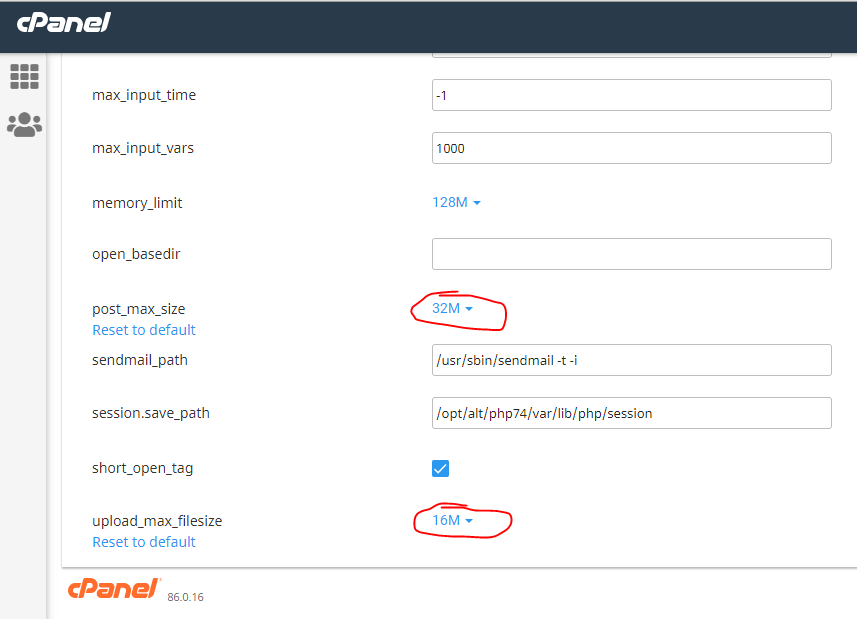

# Lumen PHP Framework

[](https://travis-ci.org/laravel/lumen-framework)
[](https://packagist.org/packages/laravel/lumen-framework)
[](https://packagist.org/packages/laravel/lumen-framework)
[](https://packagist.org/packages/laravel/lumen-framework)

Laravel Lumen is a stunningly fast PHP micro-framework for building web applications with expressive, elegant syntax. We believe development must be an enjoyable, creative experience to be truly fulfilling. Lumen attempts to take the pain out of development by easing common tasks used in the majority of web projects, such as routing, database abstraction, queueing, and caching.

## How to run on local
Sau khi pull code về thì:
- Cần tạo file .env ở thư mục gốc, sau đó sửa file này giống với file .env.prd (config phù hợp với local)
- Cài thư viện: ```composer install``` (lệnh này sẽ tải các dependency và lưu vào thư mục vender)
- Run project: ```php -S localhost:8888 -t public```

## Chú ý
- Khi copy file lên product (hosting), thì phải sửa file .env (bằng cách copy nội dung của file .env.prd vào file .env là được). Còn nữa, copy file lên product chỉ cần copy thư mục `vendor` ở lần đầu tiên thôi, từ lần sau nếu ko update dependency gì (file `composer.json` ko thay đổi) thì ko cần copy lại thư mục này nữa
- File .env.prd ko dùng, nó chỉ lưu config ở product thôi
- Trên cpanel cần sửa 2 tham số sau, nếu ko sẽ KHÔNG upload được file: upload_max_filesize và post_max_size:



Thường thì post_max_size > upload_max_filesize (cpanel gợi ý vậy).  
Ref: https://chemicloud.com/kb/article/how-to-increase-the-upload_max_filesize-limit-in-cpanel/

## Notes
### Return an object
Chẳng hạn ta muốn mọi API đều return theo 1 format là kiểu Result:
```php
public function getSongById($id)
{
  $song = Song::find($id);
  $result = new Result();
  $result->successRes($song);
  return $result;
}
```

Muốn làm được như vậy thì class Result phải implement 1 trong 2 interface sau: ```Arrayable``` (phải override method ```toArray```) hoặc ```Jsonable``` (phải override method ```toJson```), bởi vì class Illuminate\Http\Response có method convert object sang JSON như sau:
```php
protected function morphToJson($content)
{
  if ($content instanceof Jsonable) {
    return $content->toJson();
  } elseif ($content instanceof Arrayable) {
    return json_encode($content->toArray());
  }

  return json_encode($content);
}
```

## Official Documentation

Documentation for the framework can be found on the [Lumen website](https://lumen.laravel.com/docs).

## Contributing

Thank you for considering contributing to Lumen! The contribution guide can be found in the [Laravel documentation](https://laravel.com/docs/contributions).

## Security Vulnerabilities

If you discover a security vulnerability within Lumen, please send an e-mail to Taylor Otwell at taylor@laravel.com. All security vulnerabilities will be promptly addressed.

## License

The Lumen framework is open-sourced software licensed under the [MIT license](https://opensource.org/licenses/MIT).
